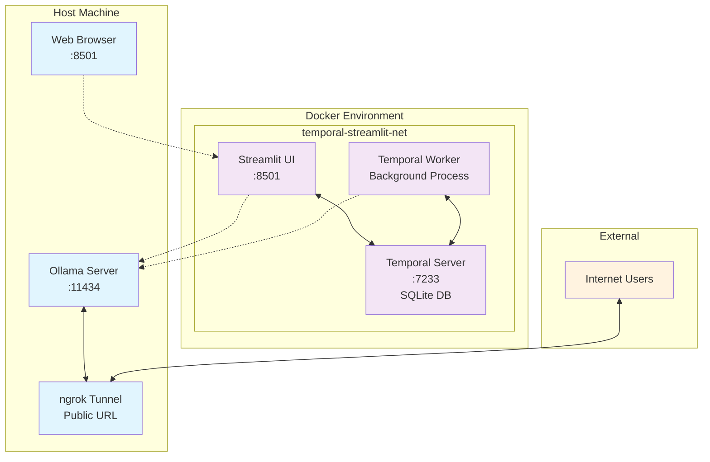

# Remote Ollama with ngrok

This project provides a simple and robust configuration to expose your local Ollama server to the internet using the `ngrok` agent. It includes a Streamlit-based chat UI with Temporal workflow orchestration for enhanced reliability and scalability.

## Architecture



### Component Overview

- **Ollama Server**: Local LLM server (external to Docker, accessible via ngrok)
- **Temporal Server**: Workflow orchestration with SQLite persistence (Docker)
- **Streamlit UI**: Web-based chat interface (Docker)
- **Temporal Worker**: Background workflow execution (Docker)
- **ngrok Tunnel**: Secure public access to local Ollama instance

### Data Flow

1. Users access the Streamlit UI via web browser
2. UI submits chat requests through Temporal workflows
3. Worker processes workflows and communicates with Ollama
4. External users can access Ollama directly via ngrok tunnel
5. All Docker services communicate via `temporal-streamlit-net` network

This setup is based on the best practices found in the official `ngrok` documentation and community guides.

## Prerequisites

*   A local installation of [Ollama](https://ollama.com/).
*   An [ngrok account](https://dashboard.ngrok.com/signup) (a free account is sufficient).
*   The `ngrok` agent installed on your system. You can find installation instructions [here](https://ngrok.com/docs/getting-started/#2-install-the-ngrok-agent-cli).
*   `make` (usually pre-installed on macOS and Linux).
*   [Docker](https://docs.docker.com/get-docker/) and [Docker Compose](https://docs.docker.com/compose/install/).

## Setup

1.  **Clone the repository:**
    ```bash
    git clone https://github.com/LaansDole/ngrok-ollama.git
    cd remote-ollama
    ```

2.  **Configure your ngrok Authtoken:**
    You must authenticate the `ngrok` agent. Get your authtoken from the [ngrok dashboard](https://dashboard.ngrok.com/get-started/your-authtoken) and run the following command in your terminal, replacing `YOUR_NGROK_TOKEN` with your actual token:
    ```bash
    make setup # To see the documentation for setting up ngrok
    ngrok config add-authtoken YOUR_NGROK_TOKEN
    ```

3.  **Reserve a Domain:**
    This setup uses a static domain for a consistent URL. Reserve a free static domain on the [ngrok domains page](https://dashboard.ngrok.com/domains).

4.  **Configure Environment Variables:**

    **For the main project (ngrok configuration):**
    *   Copy the example environment file: `cp .env.example .env`
    *   Edit the `.env` file and replace `YOUR_RESERVED_DOMAIN.ngrok.app` with the domain you reserved in the previous step.

    **For the UI services:**
    *   The UI has separate environment configuration in `ui/.env` and `ui/.env.example`
    *   For local development, the default `ui/.env` should work out of the box
    *   For Docker deployment, you can use the provided `ui/.env.example` as a template

    **Key Environment Variables:**
    ```bash
    # Main project (.env)
    NGROK_DOMAIN=your-reserved-domain.ngrok.app

    # UI configuration (ui/.env)
    DEFAULT_MODEL=deepseek-r1:671b        # Default LLM model
    TEMPORAL_TASK_QUEUE=ollama-task-queue # Temporal task queue name
    OLLAMA_API_URL=http://localhost:11434/api/chat  # Ollama API endpoint
    TEMPORAL_HOST=localhost               # Temporal server host
    TEMPORAL_PORT=7233                   # Temporal server port
    ```

## Usage

### Quick Start Commands

The project includes a comprehensive Makefile with the following commands:

```bash
# Setup and configuration
make setup          # Display ngrok setup instructions
make help           # Show all available commands
```

### Running with Docker Compose (Recommended)

This method runs the Streamlit UI, Temporal worker, and Temporal server in Docker containers.

1.  **Start Ollama on your host machine:**
    ```bash
    OLLAMA_HOST=0.0.0.0 ollama serve
    ```

2.  **Start all services with Docker Compose:**
    ```bash
    # Start Temporal server
    make run-temporal
    
    # Start UI and worker services
    docker-compose up --build
    ```
    
    The Streamlit UI will be available at `http://localhost:8501`.
    The Temporal Web UI will be available at `http://localhost:8080`.

3.  **Expose the Streamlit UI via ngrok (optional):**
    ```bash
    make expose  # Exposes port 8501 by default
    ```

### Running Manually (Local Development)

For local development and testing:

1.  **Start Ollama Server:**
    ```bash
    OLLAMA_HOST=0.0.0.0 ollama serve
    ```

2.  **Start Temporal Server:**
    ```bash
    make run-temporal
    ```

3.  **Install UI Dependencies:**
    ```bash
    make ui-install
    ```

4.  **Start the Temporal Worker (Terminal 1):**
    ```bash
    make run-worker
    ```

5.  **Start the Streamlit UI (Terminal 2):**
    ```bash
    make ui-run
    ```

6.  **Expose via ngrok (optional):**
    ```bash
    # Expose Ollama directly
    make expose PORT=11434
    
    # Or expose the Streamlit UI
    make expose PORT=8501
    ```

### Testing

The project includes comprehensive tests in the `ui/test/` directory:

```bash
# Run individual tests
python3 ui/test/test_connection.py
python3 ui/test/test_worker.py
python3 ui/test/test_streamlit_connection.py

# Run all tests
python3 ui/test/run_all_tests.py
```

## Troubleshooting

Here are some common errors and their solutions:

### `ERR_NGROK_4018`: Authentication Failed

*   **Error Message:** `ERROR: authentication failed: Usage of ngrok requires a verified account and authtoken.`
*   **Solution:** This means your `ngrok` agent is not authenticated. Follow step 2 in the **Setup** section to add your authtoken.

### `Error reading configuration file 'ollama.yaml'`

*   **Error Messages:** `version property is required` or `field traffic_policy not found in type config.v2yamlConfig`
*   **Solution:** This indicates an issue with the traffic policy file or how it's being loaded. This project is pre-configured to handle this correctly, but ensure that the `expose` command in the `Makefile` uses the `--traffic-policy-file` flag, not `--config`.

## Performance Considerations

**⚠️ Latency Impact**: ngrok introduces approximately **50-100ms additional latency** to API calls. This is acceptable for development and demonstration purposes but may impact user experience in production environments.

📊 **Performance Guide**: See [ngrok Latency Guide](docs/ngrok-latency-guide.md) for benchmarks, optimization tips, and alternative recommendations.

## References

This project was built using information from the following resources:

*   **ngrok Documentation:** [Expose and Secure Your Self-Hosted Ollama API](https://ngrok.com/docs/universal-gateway/examples/ollama/)
*   **thoughtbot Blog:** [How to use ngrok and Ollama to access a local LLM remotely](https://thoughtbot.com/blog/ngrok-and-ollama)
*   **Ollama on Homebrew:** [formulae.brew.sh/formula/ollama](https://formulae.brew.sh/formula/ollama)
*   **Temporal Documentation:** [Official Temporal Docker Compose Setup](https://github.com/temporalio/docker-compose)
*   **Performance Analysis:** [ngrok Latency Guide](docs/ngrok-latency-guide.md)
