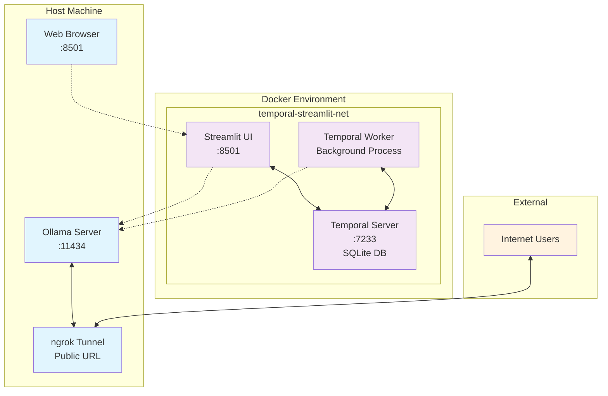

# Remote Ollama with ngrok

This project provides a simple and robust configuration to expose your local Ollama server to the internet using the `ngrok` agent. It includes a Streamlit-based chat UI with Temporal workflow orchestration for enhanced reliability and scalability.

## Architecture



### Component Overview

- **Ollama Server**: Local LLM server (external to Docker, accessible via ngrok)
- **Temporal Server**: Workflow orchestration with SQLite persistence (Docker)
- **Streamlit UI**: Web-based chat interface (Docker)
- **Temporal Worker**: Background workflow execution (Docker)
- **ngrok Tunnel**: Secure public access to local Ollama instance

### Data Flow

1. Users access the Streamlit UI via web browser
2. UI submits chat requests through Temporal workflows
3. Worker processes workflows and communicates with Ollama
4. External users can access Ollama directly via ngrok tunnel
5. All Docker services communicate via `temporal-streamlit-net` network

This setup is based on the best practices found in the official `ngrok` documentation and community guides.

## Prerequisites

*   A local installation of [Ollama](https://ollama.com/).
*   An [ngrok account](https://dashboard.ngrok.com/signup) (a free account is sufficient).
*   The `ngrok` agent installed on your system. You can find installation instructions [here](https://ngrok.com/docs/getting-started/#2-install-the-ngrok-agent-cli).
*   `make` (usually pre-installed on macOS and Linux).
*   [Docker](https://docs.docker.com/get-docker/) and [Docker Compose](https://docs.docker.com/compose/install/).

## Setup

1.  **Clone the repository:**
    ```bash
    git clone https://github.com/LaansDole/ngrok-ollama.git
    cd remote-ollama
    ```

2.  **Configure your ngrok Authtoken:**
    You must authenticate the `ngrok` agent. Get your authtoken from the [ngrok dashboard](https://dashboard.ngrok.com/get-started/your-authtoken) and run the following command in your terminal, replacing `YOUR_NGROK_TOKEN` with your actual token:
    ```bash
    make setup # To see the documentation for setting up ngrok
    ngrok config add-authtoken YOUR_NGROK_TOKEN
    ```

3.  **Reserve a Domain:**
    This setup uses a static domain for a consistent URL. Reserve a free static domain on the [ngrok domains page](https://dashboard.ngrok.com/domains).

4.  **Configure Environment Variables:**
    *   Copy the example environment file: `cp .env.example .env`
    *   Edit the `.env` file and replace `YOUR_RESERVED_DOMAIN.ngrok.app` with the domain you reserved in the previous step.

## Usage

### Running with Docker Compose (Recommended)

This method runs the Streamlit UI, Temporal worker, and Temporal server in Docker containers. **Note: You need to have Ollama running separately on your host machine.**

1.  **Start Ollama on your host machine:**
    ```bash
    OLLAMA_HOST=0.0.0.0 ollama serve
    ```

2.  **Start the UI, Worker, and Temporal Server:**
    ```bash
    docker-compose -f docker-compose.ui.yml up --build
    ```
    
    The UI will be available at `http://localhost:8501`.

### Running Manually

If you prefer to run the services manually without Docker, you can follow these steps:

1.  **Start your Ollama Server:**
    For `ngrok` to access your Ollama instance, you must start it so that it listens on all network interfaces. Open a new terminal and run:
    ```bash
    OLLAMA_HOST=0.0.0.0 ollama serve
    ```

2.  **Start the ngrok Tunnel:**
    In the project directory, simply run:
    ```bash
    make run
    ```
    This command will read your `.env` file and start the `ngrok` tunnel using the traffic policy defined in `ollama.yaml`. You will see the public URL in your terminal.

3.  **Set up and Run the Ollama Chat UI:**
    You will need to run the Temporal worker and the Streamlit UI in separate terminals.

    *   **Terminal 1: Install Dependencies**
        ```bash
        make ui-install
        ```

    *   **Terminal 2: Start the Temporal Worker**
        ```bash
        make ui-worker
        ```

    *   **Terminal 3: Start the Streamlit UI**
        ```bash
        make ui-run
        ```

    Now you can access the chat UI in your browser at the address provided by Streamlit (usually `http://localhost:8501`).

    **Note:** For manual setup, you'll also need to run a Temporal server separately. You can use Docker for this:
    ```bash
    docker run --rm -p 7233:7233 temporalio/auto-setup:1.10.0
    ```

## Troubleshooting

Here are some common errors and their solutions:

### `ERR_NGROK_4018`: Authentication Failed

*   **Error Message:** `ERROR: authentication failed: Usage of ngrok requires a verified account and authtoken.`
*   **Solution:** This means your `ngrok` agent is not authenticated. Follow step 2 in the **Setup** section to add your authtoken.

### `Error reading configuration file 'ollama.yaml'`

*   **Error Messages:** `version property is required` or `field traffic_policy not found in type config.v2yamlConfig`
*   **Solution:** This indicates an issue with the traffic policy file or how it's being loaded. This project is pre-configured to handle this correctly, but ensure that the `run` command in the `Makefile` uses the `--traffic-policy-file` flag, not `--config`.

### Ollama Server Not Accessible from Tunnel

*   **Symptom:** The `ngrok` tunnel is running, but you get errors when trying to access your Ollama server through the public URL.
*   **Solution:** Ensure you have started the Ollama server as described in step 1 of the **Usage** section, with the `OLLAMA_HOST` environment variable set to `0.0.0.0`.

## Performance Considerations

**⚠️ Latency Impact**: ngrok introduces approximately **50-100ms additional latency** to API calls. This is acceptable for development and demonstration purposes but may impact user experience in production environments.

📊 **Performance Guide**: See [ngrok Latency Guide](docs/ngrok-latency-guide.md) for benchmarks, optimization tips, and alternative recommendations.

## References

This project was built using information from the following resources:

*   **ngrok Documentation:** [Expose and Secure Your Self-Hosted Ollama API](https://ngrok.com/docs/universal-gateway/examples/ollama/)
*   **thoughtbot Blog:** [How to use ngrok and Ollama to access a local LLM remotely](https://thoughtbot.com/blog/ngrok-and-ollama)
*   **Ollama on Homebrew:** [formulae.brew.sh/formula/ollama](https://formulae.brew.sh/formula/ollama)
*   **Performance Analysis:** [ngrok Latency Guide](docs/ngrok-latency-guide.md)
